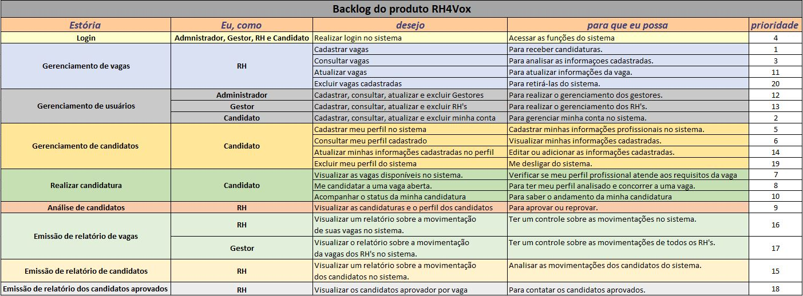
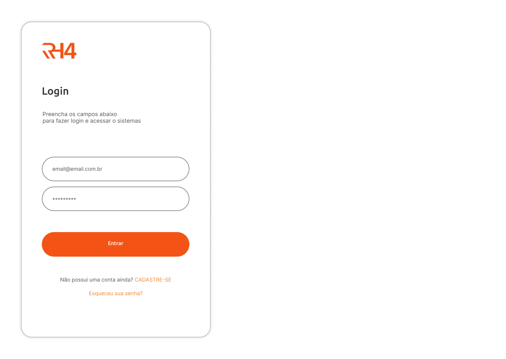
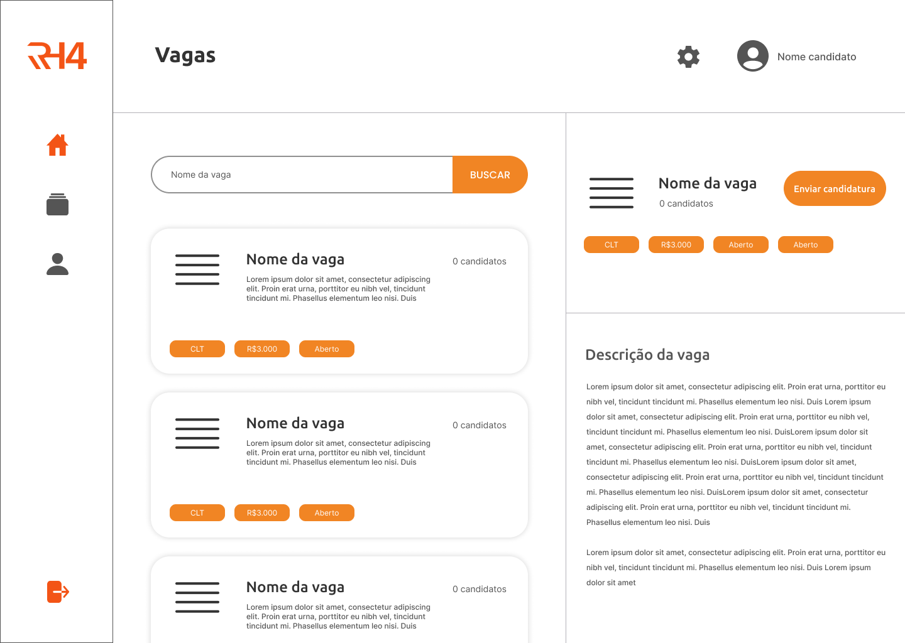
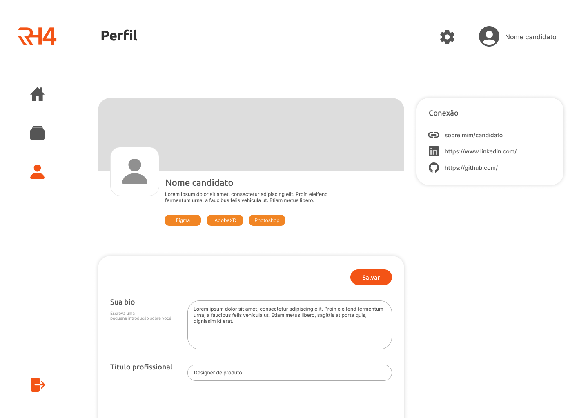
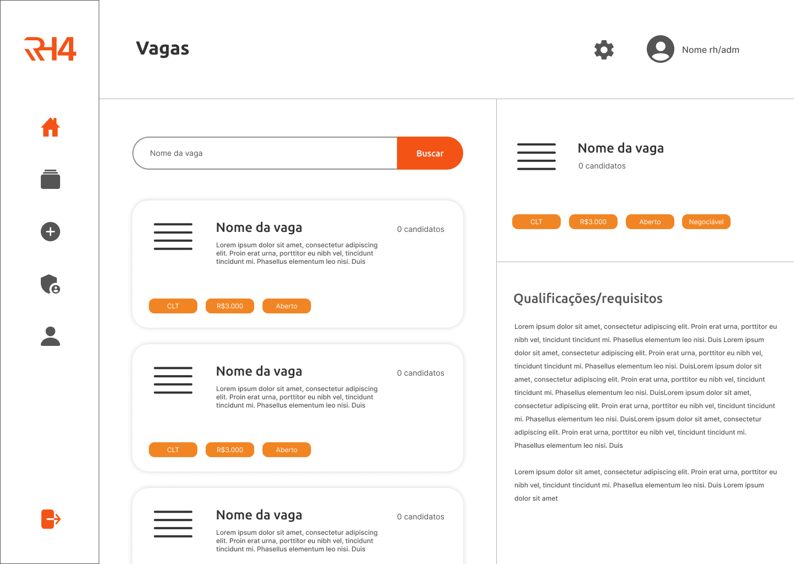
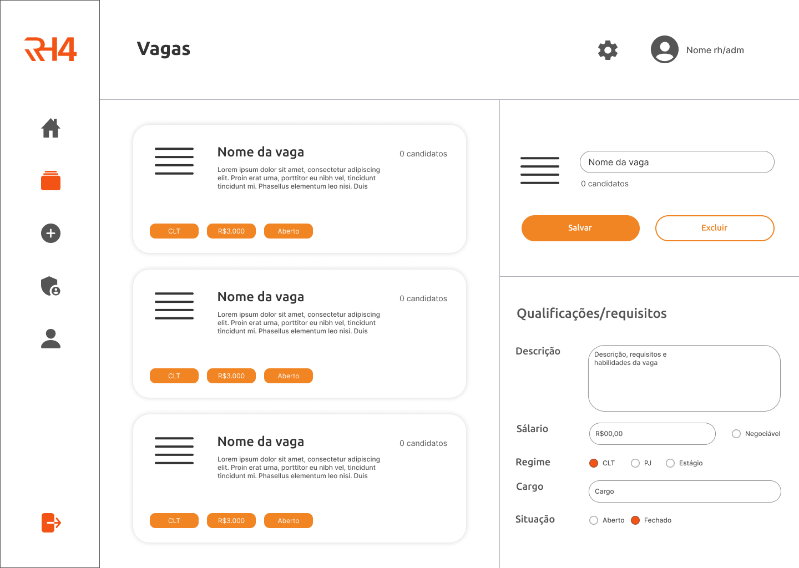
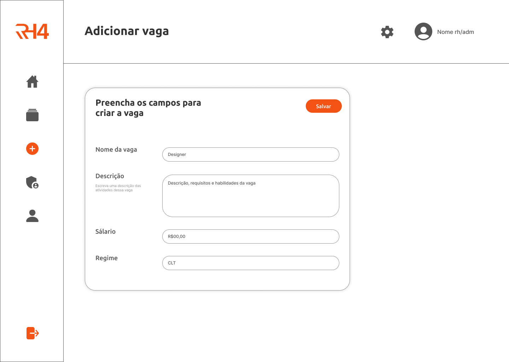

# Sistema de gerenciamento de vagas: RH4Vox

### Desenvolvido para API (Aprendizagem por Projeto Integrador) da Fatec São José dos Campos - Banco de Dados

<br>

<p align="left">O RH4Vox é um sistema para gerenciamento de vagas de emprego e candidaturas de profissionais interessados. Permite também o controle de RH´s por seus gestores, por meio de relatórios gerados pelo sistema.</p>

<br>

## 🙅‍♂️ Equipe

#### **Equipe Vox**

#### **Integrantes:** 
- João Vitor Marques (Scrum Master) - [Linkedin](https://www.linkedin.com/in/joao-vitor-da-silva-marques-944b461bb/)
- Silas Rafael (Product Owner) - [Linkedin]()
- Hamilton Roberto (Desenvolvedor) - [Linkedin]()

<br>

## 👨‍💻 Tecnologias

#### Este sistema foi desenvolvido com as seguintes tecnologias e bibliotecas:

- **Design:** [Figma](https://www.figma.com/)
- **Linguagem:** [Java](https://www.java.com/pt-BR/)
- **Kit de desenvolvimento:** [JavaFX](https://openjfx.io/)
- **Banco de dados:** [PostgreSQL](https://www.postgresql.org/)

<br>

## 🕛 Cronograma

<a href="https://github.com/equipe-vox/rh4vox/tree/master/images/backlog/backlogS1.jpeg">Sprint 1: 29/08 - 18/09</a>
<a href="https://github.com/equipe-vox/rh4vox/tree/master/images/backlog/backlogS2.jpeg">Sprint 2: 19/09 - 09/10</a> 
<a href="https://github.com/equipe-vox/rh4vox/tree/master/images/backlog/backlogS3.jpeg">Sprint 3: 13/10 - 06/11</a>  
<a href="https://github.com/equipe-vox/rh4vox/tree/master/images/backlog/backlogS4.jpeg">Sprint 4: 07/11 - 27/11</a>  


<br>

## 📃 Backlog



<br>

## 📈 Burn Down

<a href="https://github.com/equipe-vox/rh4vox/tree/master/images/burndown/burndown-sp1.png">Sprint Burn Down 1</a>
<br>
<a href="https://github.com/equipe-vox/rh4vox/tree/master/images/burndown/burndown-sp2.png">Sprint Burn Down 2</a>

<br>

## ℹ️ Como usar o aplicativo

### Pré-requisitos

Para clonar e rodar a aplicação, é necessário ter instalado em sua máquina o [Java 11](https://www.java.com/pt-BR/) e [JavaFX SDK](https://www.oracle.com/java/technologies/install-javafx-sdk.html), [Git](https://git-scm.com) e [Maven Apache](https://maven.apache.org/).
Além disso, é legal ter um bom editor de código, como o [VSCode](https://code.visualstudio.com/).

### 🎲 Rodando a aplicação

```bash
# Clone este repositório
$ git clone <https://github.com/equipe-vox/rh4vox>
# Acesse a pasta do projeto no terminal
$ cd rh4vox
# Navegue até a pasta 'rh4vox' novamente
$ cd rh4vox
# Dentro da pasta 'rh4vox', execute o comando no terminal
$ mvn exec:java
# O projeto deverá ser executado em alguns segundos.
```
<br>

## 🖥️ Mockups

- #### **Candidato:**
<br>




<br>
<br>

#

- #### **Administrador/RH:**
<br>



